# 洪弟食品机械产品列表资料

> 整理依据：官网当前启用的中文产品库及 `public/images/products/new-2026/` 产品图片。
>
> 数量说明：当前官网实际启用 **11 款产品，共 22 张图片**，每款产品包含 1 张产品图和 1 张详情图。本文按产品去重整理，不把同一款产品的两张图片重复计算为两款产品。
>
> 参数说明：图片或现有产品资料没有明确给出的参数统一标注为“待厂家确认”，避免使用未经确认的数据。

## 产品目录

1. 新一代气动翻出泡水脱毛一体机
2. 气动翻出泡水脱毛一体机
3. 双面翻盖不锈钢鸡鹅鸭搅拌机
4. 胶棒搅拌不锈钢鸡鹅鸭泡水机
5. 80×100小型两面翻泡水机
6. 58型脱毛机
7. 64型脱鸟圆筒脱毛机
8. 3滚筒不锈钢脱毛机
9. 6滚筒不锈钢脱毛机
10. 9滚筒不锈钢脱毛机
11. 不锈钢九筒脱毛机

---

## 1. 新一代气动翻出泡水脱毛一体机

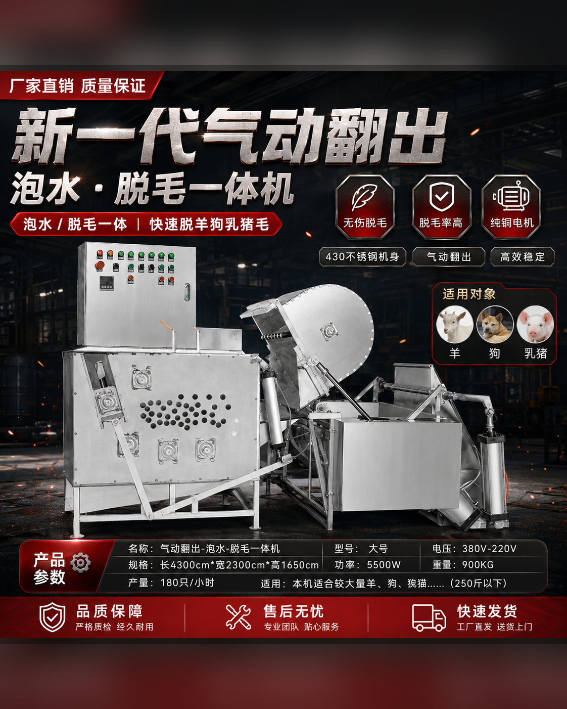

### 产品介绍

新一代气动翻出泡水脱毛一体机把泡水浸烫、脱毛和气动翻出集中在一套设备中，适合需要减少人工搬运、提高工序连续性的加工场所。设备采用气动机构完成翻斗和出料动作，可降低物料在不同设备之间反复转运的劳动强度。

### 核心卖点

- 泡水、脱毛和气动翻出一体化，缩短物料转运路径。
- 气动驱动翻出，出料更省力。
- 配置控制电箱和纯铜电机，便于集中操作。
- 不锈钢主体和稳固机架，适合连续加工环境。

### 适用场景

- 羊、乳猪等食品加工脱毛处理
- 需要连续泡水、脱毛和出料的加工场所
- 希望减少人工搬运的中大型加工点
- 屠宰场、养殖场及食品前处理车间

### 产品参数

| 参数项 | 内容 |
| --- | --- |
| 型号 | 大号 / 新一代气动翻出型 |
| 规格 | 4300 × 2300 × 1650 mm |
| 功率 | 5500 W |
| 电压 | 380 V / 220 V，按设备配置确认 |
| 重量 | 900 kg |
| 产量 | 约180只/小时 |
| 核心结构 | 控制电箱、翻出泡毛斗、翻入倒入斗、脱毛区、气动气缸、主机框架 |
| 机身特点 | 不锈钢主体，一体化布局，气动翻出，结构稳固 |

---

---

## 2. 气动翻出泡水脱毛一体机

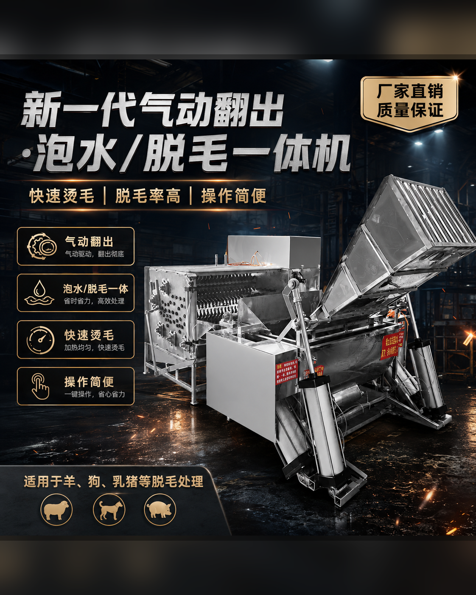

### 产品介绍

气动翻出泡水脱毛一体机将泡水浸烫、脱毛和翻出出料组合在一套设备中，适合希望简化前处理流程、减少人工搬运的加工客户。设备通过气动机构完成翻斗动作，能够衔接泡水、脱毛和出料工序。

### 核心卖点

- 泡水与脱毛一体化，减少设备之间的重复搬运。
- 气动翻出结构，出料操作更省力。
- 不锈钢主体，适应潮湿的食品加工环境。
- 操作集中，流程连贯，适合中小批量连续处理。

### 适用场景

- 屠宰档口和养殖场加工
- 食堂或食品加工点集中处理
- 需要泡水、脱毛、出料连续衔接的场所
- 希望减少人工搬运和工位占用的客户

### 产品参数

| 参数项 | 内容 |
| --- | --- |
| 型号 | 气动翻出型 |
| 规格 | 待厂家确认 |
| 功率 | 待厂家确认 |
| 电压 | 380 V常用，具体按配置确认 |
| 重量 | 待厂家确认 |
| 产量 | 适合小中批量连续处理，精确产量待确认 |
| 核心结构 | 泡水槽、脱毛区、翻入料斗、翻出料斗、气动气缸、控制机构 |
| 机身特点 | 不锈钢主体，一体化工序，气动翻出、操作省力 |

---

---

## 3. 双面翻盖不锈钢鸡鹅鸭搅拌机

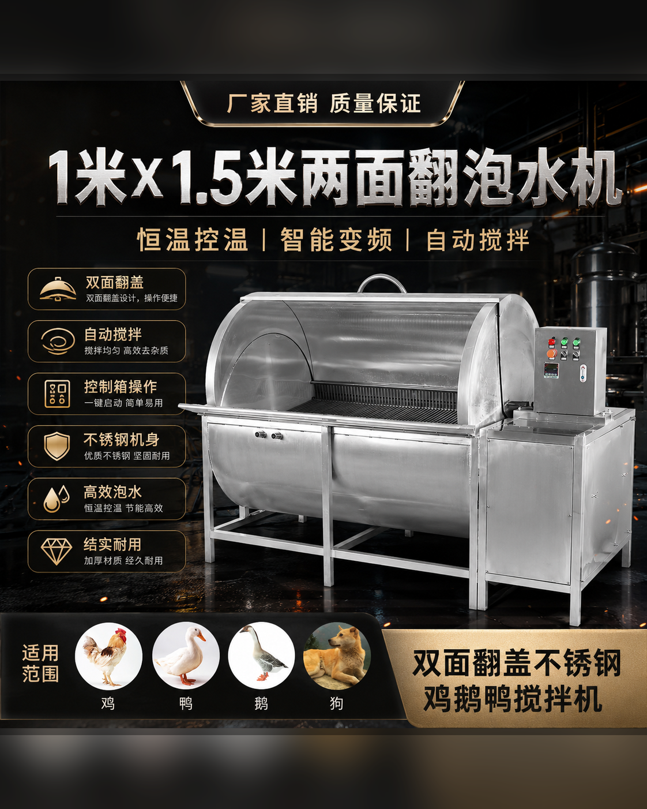

### 产品介绍

双面翻盖不锈钢鸡鹅鸭搅拌机是一款用于家禽脱毛前浸烫、泡水和自动翻料的设备。设备通过双面翻盖和内部翻料结构，使鸡、鸭、鹅等物料受热更加均匀，可减少人工翻料强度，适合中大型泡水和连续前处理场景。

### 核心卖点

- 双面翻盖设计，投料、观察和清理更加方便。
- 自动搅拌翻料，帮助物料均匀浸烫。
- 支持恒温控制和智能变频，便于调节处理节奏。
- 不锈钢机身，适合潮湿的食品前处理环境。

### 适用场景

- 鸡、鸭、鹅脱毛前浸烫
- 中大型屠宰档口和养殖场
- 食品加工厂家禽前处理
- 需要减少人工翻料的批量泡水工序

### 产品参数

| 参数项 | 内容 |
| --- | --- |
| 型号 | 大号泡水机 / 双面翻盖型 |
| 规格 | 1700 × 1200 × 1000 mm |
| 功率 | 1500 W |
| 电压 | 220 V / 380 V |
| 重量 | 250 kg |
| 产量 | 约500只/小时 |
| 核心结构 | 双面顶盖、扇叶翻料斗、入水口、控制箱、自动搅拌机构 |
| 机身特点 | 不锈钢机身，支持恒温控制、智能变频和自动搅拌 |

---

---

## 4. 胶棒搅拌不锈钢鸡鹅鸭泡水机

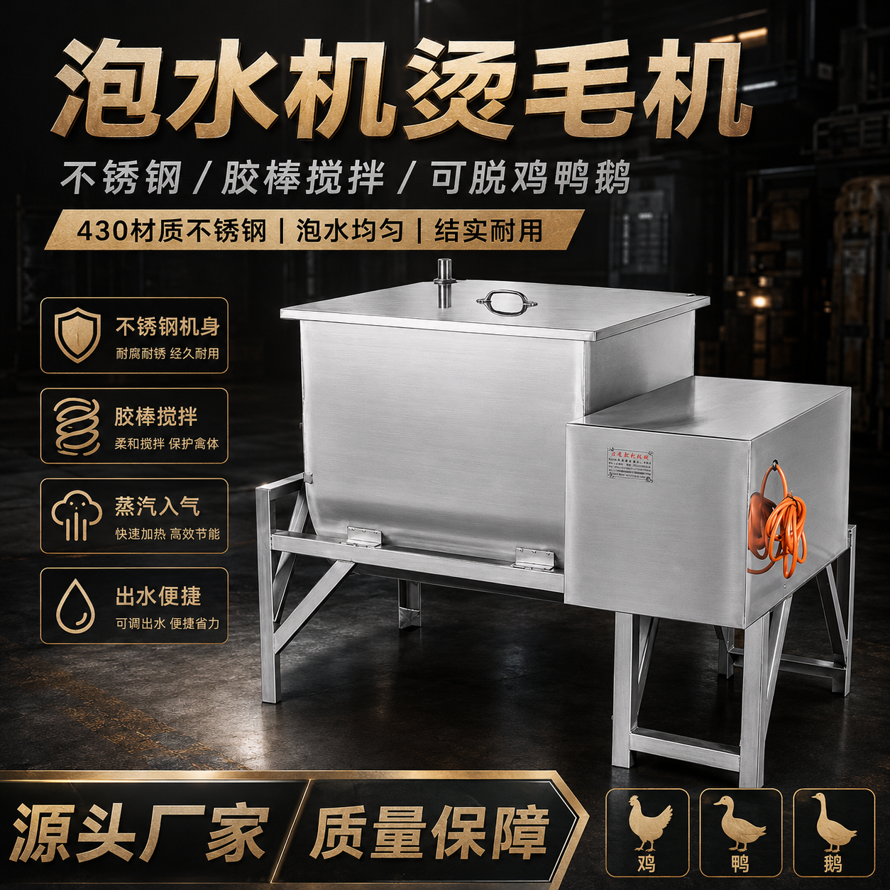

### 产品介绍

胶棒搅拌不锈钢鸡鹅鸭泡水机用于鸡、鸭、鹅等家禽脱毛前的泡水浸烫和均匀翻料。设备通过胶棒搅拌帮助物料均匀受热，并配置蒸汽入气口、进料盖及排水结构，适合中小批量前处理。

### 核心卖点

- 胶棒自动搅拌，帮助物料均匀受热。
- 支持蒸汽入气加热，提升泡水效率。
- 配置可调漏水和出水结构，便于排水清洗。
- 不锈钢机身和不锈钢轴承，结构实用、维护方便。

### 适用场景

- 鸡、鸭、鹅脱毛前泡水浸烫
- 中小型屠宰档口
- 养殖场集中前处理
- 需要减少人工翻料的泡水工序

### 产品参数

| 参数项 | 内容 |
| --- | --- |
| 型号 | 中号泡水机 / 胶棒搅拌型 |
| 规格 | 1100 × 860 × 900 mm |
| 功率 | 1500 W |
| 电压 | 220 V / 380 V |
| 重量 | 120 kg |
| 产量 | 约200只/小时 |
| 核心结构 | 进料盖、胶棒搅拌机构、蒸汽入气口、不锈钢轴承、可调漏水口、出水口 |
| 机身特点 | 不锈钢机身，结构稳固、受热均匀、易清洁维护 |

---

---

## 5. 80×100小型两面翻泡水机

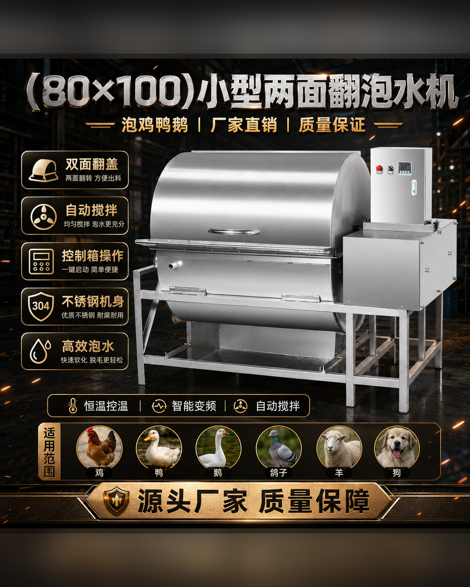

### 产品介绍

80×100小型两面翻泡水机是一款适合小型档口和紧凑场地的家禽浸烫设备。设备采用双面翻盖和自动搅拌结构，并支持恒温控制和智能变频，帮助鸡、鸭、鹅等物料在脱毛前均匀受热。

### 核心卖点

- 双面翻盖设计，泡水、投料和清理更方便。
- 自动搅拌，使物料受热更加均匀。
- 恒温控制和智能变频，便于调整泡水节奏。
- 结构紧凑，适合场地有限的小型加工点。

### 适用场景

- 小型鲜禽档口
- 食堂和餐饮门店后厨
- 小批量鸡、鸭、鹅浸烫
- 需要小型泡水设备的紧凑场地

### 产品参数

| 参数项 | 内容 |
| --- | --- |
| 型号 | 80 × 100型 |
| 规格 | 80 × 100型，整机长宽高待厂家确认 |
| 功率 | 1500 W |
| 电压 | 220 V / 380 V |
| 重量 | 150 kg |
| 产量 | 约300只/小时 |
| 核心结构 | 双面翻盖、自动搅拌机构、控制箱、泡水槽、排水结构 |
| 机身特点 | 不锈钢机身，结构紧凑，支持恒温、变频和自动搅拌 |

---

---

## 6. 58型脱毛机

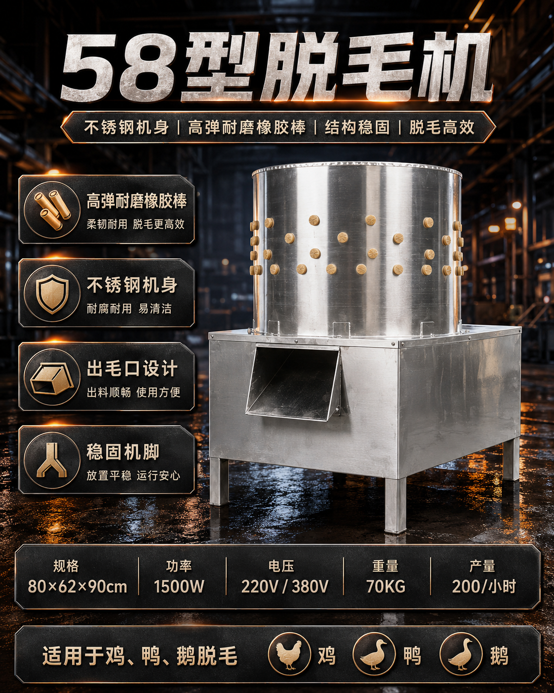

### 产品介绍

58型脱毛机是一款面向小型档口、农贸市场、养殖场和食堂后厨的小批量家禽脱毛设备。设备采用不锈钢机身和高弹耐磨橡胶棒，通过滚动摩擦完成鸡、鸭、鹅等家禽脱毛，并通过出毛口集中排出羽毛，适合日常小批量加工。

### 核心卖点

- 不锈钢机身，耐腐蚀、便于冲洗维护。
- 高弹耐磨橡胶棒，兼顾脱毛效率和禽体表面保护。
- 配置独立出毛口，排毛和清理更方便。
- 结构紧凑、机脚稳固，适合场地有限的小型加工点。

### 适用场景

- 屠宰档口、农贸市场鲜禽档口
- 小型养殖场集中处理
- 食堂、餐饮门店后厨
- 鸡、鸭、鹅等家禽小批量脱毛

### 产品参数

| 参数项 | 内容 |
| --- | --- |
| 型号 | 58型 |
| 规格 | 80 × 62 × 90 cm |
| 功率 | 1500 W |
| 电压 | 220 V / 380 V |
| 重量 | 70 kg |
| 产量 | 约200只/小时 |
| 核心结构 | 圆筒脱毛仓、高弹耐磨橡胶棒、出毛口、稳固机脚 |
| 机身特点 | 不锈钢机身，结构紧凑，耐腐蚀、易清洁 |

---

---

## 7. 64型脱鸟圆筒脱毛机

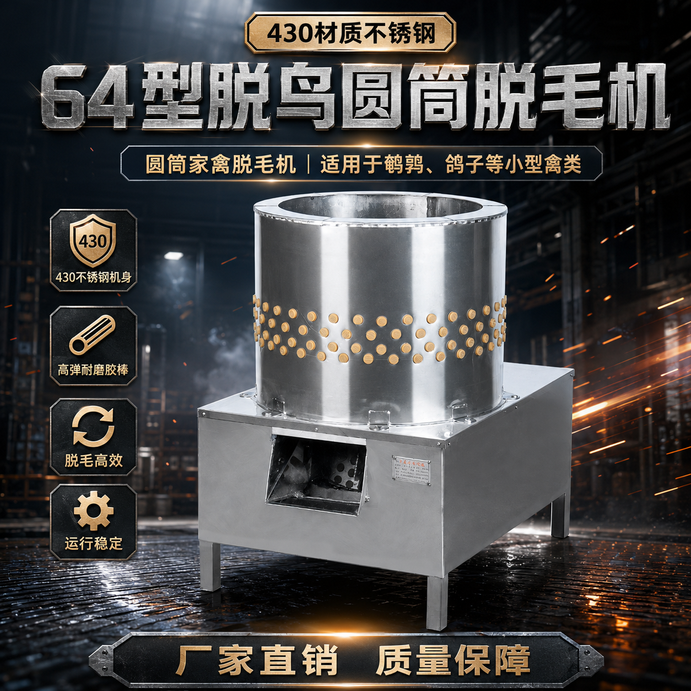

### 产品介绍

64型脱鸟圆筒脱毛机主要用于鹌鹑、鸽子等小禽类的脱毛处理。设备采用圆筒式结构和高弹耐磨橡胶棒，占地较小，适合需要处理小体型禽类的养殖场、档口及食品前处理场所。

### 核心卖点

- 430不锈钢机身，兼顾耐用性和日常清洁需求。
- 圆筒结构紧凑，占地小，适合小禽类加工场景。
- 高弹耐磨橡胶棒，帮助提高脱毛效率。
- 设置出毛口和稳固机脚，方便排毛与设备摆放。

### 适用场景

- 鹌鹑养殖及加工
- 鸽子养殖及加工
- 小禽类屠宰档口
- 小型食品前处理场所

### 产品参数

| 参数项 | 内容 |
| --- | --- |
| 型号 | 64型 |
| 规格 | 待厂家确认 |
| 功率 | 待厂家确认 |
| 电压 | 220 V / 380 V可选，具体按配置确认 |
| 重量 | 待厂家确认 |
| 产量 | 适合小禽类小批量处理，精确产量待确认 |
| 核心结构 | 圆筒脱毛仓、高弹耐磨橡胶棒、出毛口、机脚 |
| 机身特点 | 430不锈钢桶体，结构紧凑、占地小、便于冲洗 |

---

---

## 8. 3滚筒不锈钢脱毛机

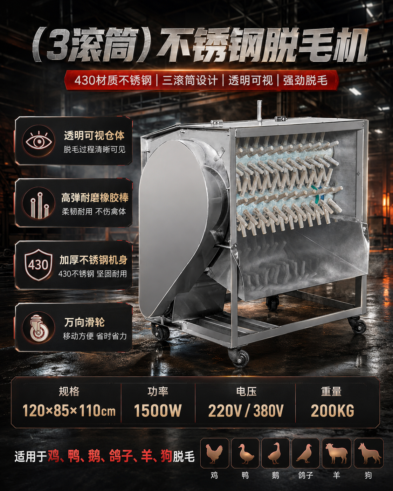

### 产品介绍

3滚筒不锈钢脱毛机是一款适合小中型批量加工的卧式家禽脱毛设备。相比单桶式脱毛机，三滚筒结构更适合连续处理，并配置透明仓体和万向滑轮，适合鲜禽档口、养殖场和小型加工点。

### 核心卖点

- 三滚筒结构，适合小中型批量连续作业。
- 透明可视仓体，便于观察脱毛过程。
- 高弹耐磨橡胶棒，柔韧耐用。
- 万向滑轮设计，方便移动和调整设备位置。

### 适用场景

- 鲜禽档口
- 小中型养殖场
- 小型食品加工点
- 鸡、鸭、鹅、鸽子等家禽脱毛

### 产品参数

| 参数项 | 内容 |
| --- | --- |
| 型号 | 3滚筒 |
| 规格 | 120 × 85 × 110 cm |
| 功率 | 1500 W |
| 电压 | 220 V / 380 V |
| 重量 | 200 kg |
| 产量 | 适合连续小中批量处理，精确产量待确认 |
| 核心结构 | 三滚筒、透明可视仓体、高弹耐磨橡胶棒、传动机构、万向滑轮 |
| 机身特点 | 加厚430不锈钢机身，透明可视、坚固耐用、移动方便 |

---

---

## 9. 6滚筒不锈钢脱毛机

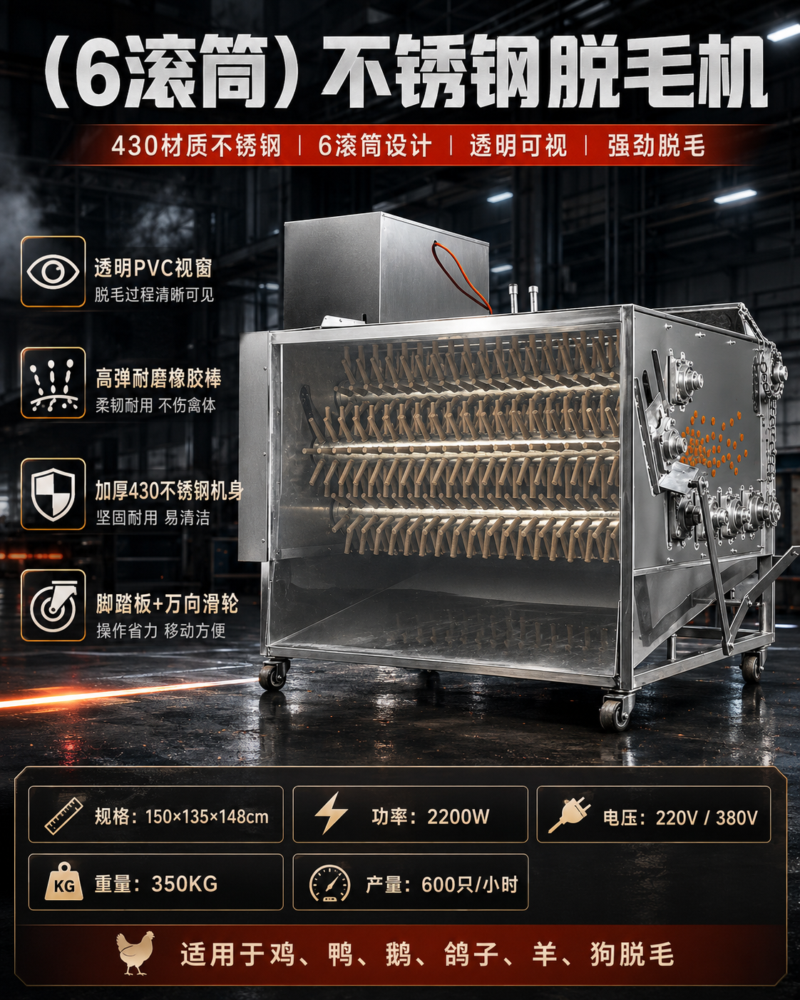

### 产品介绍

6滚筒不锈钢脱毛机适合中等产量和连续家禽脱毛作业。设备采用六滚筒结构、高弹耐磨橡胶棒及透明PVC视窗，可观察内部脱毛过程，适合养殖场、屠宰点和配送加工场所使用。

### 核心卖点

- 六滚筒结构，适合中等批量连续脱毛。
- 透明PVC视窗，便于观察作业状态。
- 加厚430不锈钢机身，坚固耐用、便于清洁。
- 脚踏板和万向滑轮设计，操作与移动更加方便。

### 适用场景

- 中型养殖场
- 家禽屠宰点和鲜禽档口
- 配送中心和食品加工点
- 鸡、鸭、鹅、鸽子等批量脱毛

### 产品参数

| 参数项 | 内容 |
| --- | --- |
| 型号 | 6滚筒 |
| 规格 | 150 × 135 × 148 cm |
| 功率 | 2200 W |
| 电压 | 220 V / 380 V |
| 重量 | 350 kg |
| 产量 | 约600只/小时 |
| 核心结构 | 六滚筒、透明PVC视窗、高弹橡胶棒、传动机构、脚踏板、万向滑轮 |
| 机身特点 | 加厚430不锈钢机身，透明可视、耐腐蚀、易清洁 |

---

---

## 10. 9滚筒不锈钢脱毛机

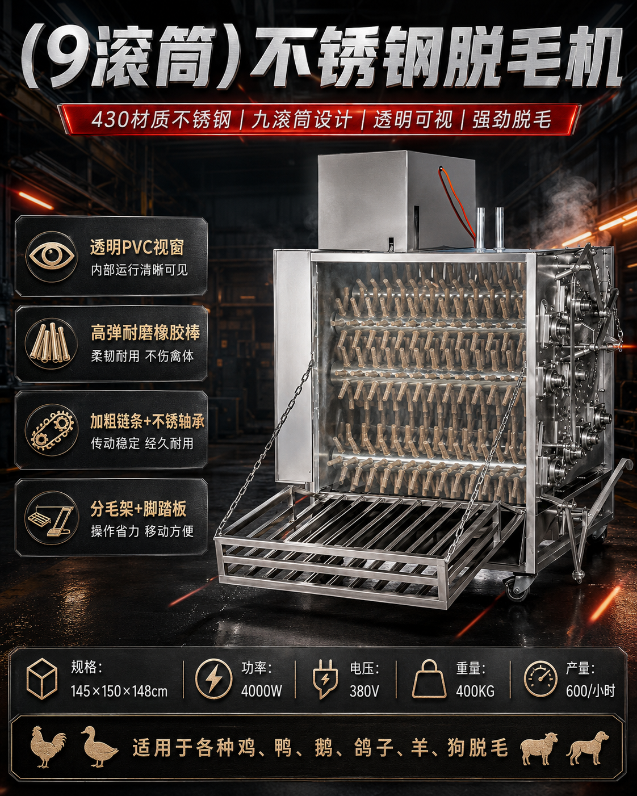

### 产品介绍

9滚筒不锈钢脱毛机是一款面向较大产量和批量连续作业的卧式家禽脱毛设备。设备采用九滚筒结构和高弹耐磨橡胶棒，透明视窗便于观察内部运行状态，适合鸡、鸭、鹅、鸽子等家禽集中脱毛。

### 核心卖点

- 九滚筒结构，适合较大批量和连续脱毛作业。
- 透明PVC视窗，内部运行状态清晰可见。
- 加粗链条和不锈钢轴承，增强传动稳定性。
- 分毛架、脚踏板和移动脚轮，方便出料、操作及转运。

### 适用场景

- 集中屠宰和较大规模家禽加工
- 大型养殖场集中出栏
- 食品加工厂家禽前处理
- 鸡、鸭、鹅、鸽子等批量脱毛

### 产品参数

| 参数项 | 内容 |
| --- | --- |
| 型号 | 9滚筒 |
| 规格 | 145 × 150 × 148 cm |
| 功率 | 4000 W |
| 电压 | 380 V |
| 重量 | 400 kg |
| 产量 | 约600只/小时 |
| 核心结构 | 九滚筒、橡胶棒、透明PVC视窗、加粗链条、不锈钢轴承、分毛架、脚踏板、滑轮 |
| 机身特点 | 430不锈钢机身，透明可视、结构厚重、适合连续作业 |

---

---

## 11. 不锈钢九筒脱毛机

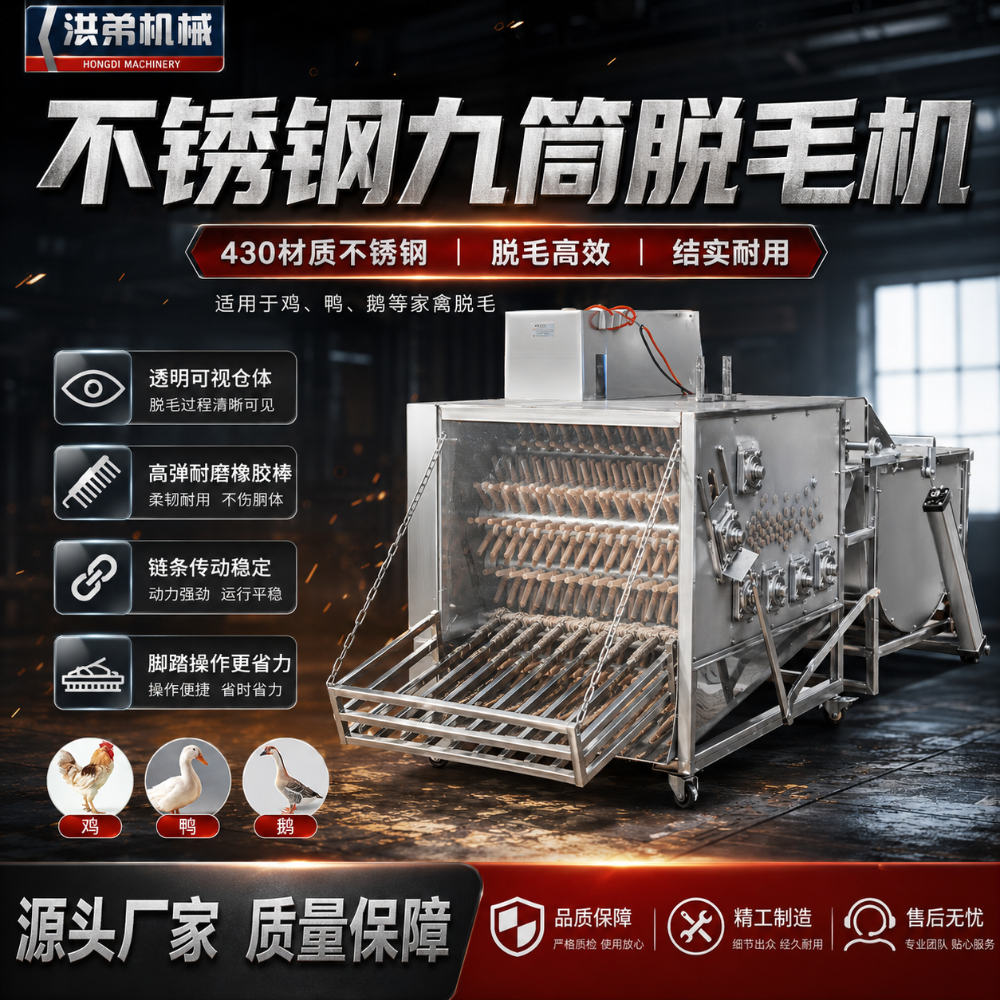

### 产品介绍

不锈钢九筒脱毛机是一款面向大批量、多工位家禽脱毛的卧式设备。设备采用九筒结构、透明可视仓体和高弹耐磨橡胶棒，可用于鸡、鸭、鹅等家禽的连续脱毛处理。

### 核心卖点

- 九筒结构，增加物料与橡胶棒的接触范围。
- 透明可视仓体，作业过程清晰可见。
- 高弹耐磨橡胶棒，兼顾脱毛效率和禽体保护。
- 脚踏操作，减少弯腰和人工操作负担。

### 适用场景

- 大型鲜禽档口和集中加工点
- 养殖基地批量处理
- 食品加工厂家禽前处理
- 鸡、鸭、鹅等家禽连续脱毛

### 产品参数

| 参数项 | 内容 |
| --- | --- |
| 型号 | 九筒型 |
| 规格 | 待厂家确认 |
| 功率 | 待厂家确认 |
| 电压 | 380 V常用，具体按配置确认 |
| 重量 | 待厂家确认 |
| 产量 | 适合大批量连续处理，精确产量待确认 |
| 核心结构 | 九筒结构、橡胶棒、透明PVC视窗、传动机构、脚踏操作机构 |
| 机身特点 | 304不锈钢机身，透明可视、结构耐用、便于清洁 |

---

## 待补充参数清单

为了形成可正式对外发送的完整产品资料，以下参数仍需要厂家确认：

| 产品 | 待确认内容 |
| --- | --- |
| 64型脱鸟圆筒脱毛机 | 整机规格、功率、重量、精确产量 |
| 气动翻出泡水脱毛一体机 | 整机规格、功率、重量、精确产量 |
| 不锈钢九筒脱毛机 | 整机规格、功率、电压、重量、精确产量 |
| 3滚筒不锈钢脱毛机 | 精确产量 |
| 80×100小型两面翻泡水机 | 整机长宽高 |

> 提醒：产品图片中的参数适合作为现阶段资料来源，但在制作报价单、合同、印刷画册或正式技术文件前，建议再与生产负责人逐项核对。
